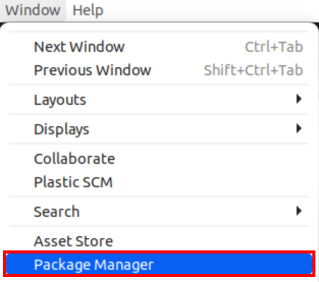
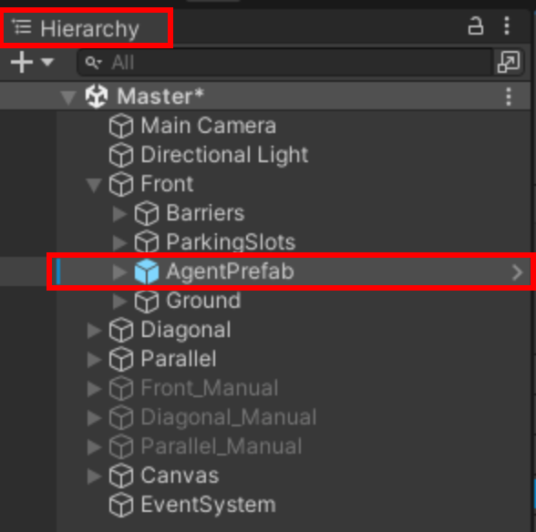
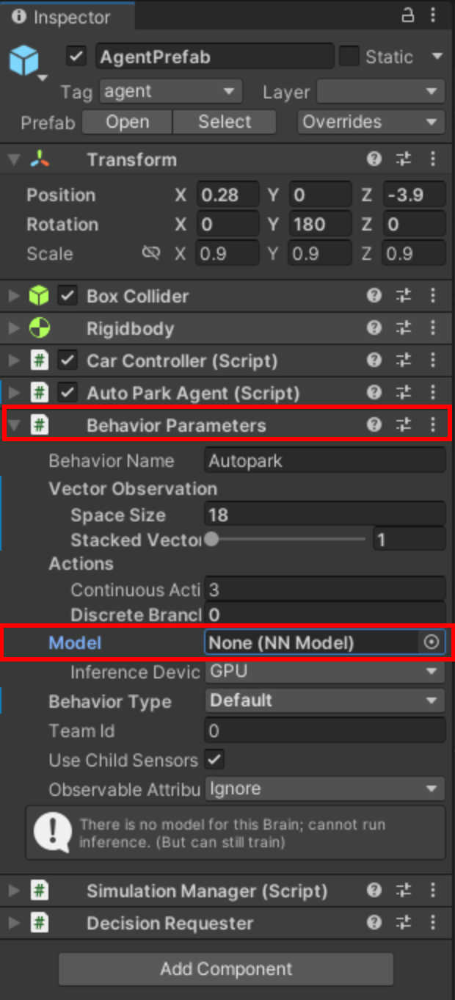
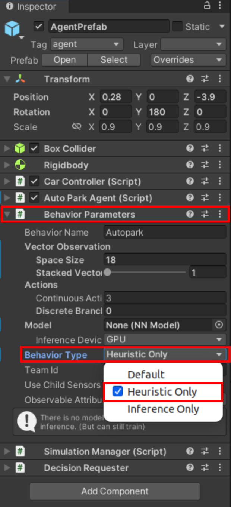

# Autonomous Parking Simulation (Updating README.md)
This project is about an autonomous parking simulation program with Unity ML-Agent.

[Program Download Link](https://drive.google.com/file/d/1nP-ikZiklXb_1zPpwrG-GXffE2ixzpMr/view?usp=sharing)

<br/>

## Installation
* Clone the git repository
    ```
    git clone https://github.com/hae-sung-oh/AutoParkSimulation.git
    ```

* Open the project with Unity Hub
    * Unity Hub -> Open -> {Select Cloned Folder} -> Open

    

    

* Add ML-Agent package in the project
    * Window -> Package Manager -> Unity Registry -> ML Agent Install

    

    <!--  -->
    

    
    
    

* Install ML-Agent
    * For Ubuntu: [Instructions](https://github.com/Unity-Technologies/ml-agents/blob/develop/docs/Installation.md)
        ```
        conda create -n autopark python=3.10
        conda activate autopark
        pip install tensorflow-gpu
        python -m pip install mlagents==0.30.0
        ```

    * For Windows: [Instructions](https://github.com/Unity-Technologies/ml-agents/blob/develop/docs/Installation-Anaconda-Windows.md)


<br/> 

## Scenes
There are 3 Unity scenes in the `/Assets/Scenes` folder for corresponding parking situations. The `Master` scene is for the `.exe` program.

* Front
    

* Parallel
    

* Diagonal
    

* Master
    


<br/>

## Training
You can train the agent with Reinforcement Learning by running commands below and hitting the 'Play' button in the Unity Editor.

Note: Don't forget to activate the virtual environment that made in the installation part.

* Default command
    ```
    mlagents-learn trainer_config.yaml
    ```

* Specify RUN_ID (You can label the custom training ID)
    ```
    mlagents-learn trainer_config.yaml --run-id={RUN_ID}
    ```

* Resume existing training with RUN_ID
    ```
    mlagents-learn trainer_config.yaml --run-id={RUN_ID} --resume
    ```

* Run existing training forcefully and overwrite it
    ```
    mlagents-learn trainer_config.yaml --run-id={RUN_ID} --force
    ```


<br/>

## Test
After the training, you can test the result with the following methods.

* Check created Neural Network Model (Behavior Parameter)

    * If you put the NN file (.onnx) created by the training into the agent object, the agent will show the trained behavior.
    * Hierarchy Tab -> Select AgentPrefab Object -> Inspector Tab -> Behavior Parameters -> Model -> Select .onnx File

    

    

    

* Heuristic Mode (Manual Control)

    * If you change the control mode of the agent to 'Heuristic', you can control the agent manually with W(acceleration), A(steer left), S(back acceleration), D(steer right), and Spacebar(brake) keys.
    * Hierarchy Tab -> Select AgentPrefab Object -> Inspector Tab -> Behavior Parameters -> Behavior Type -> Heuristic Only

    

    
